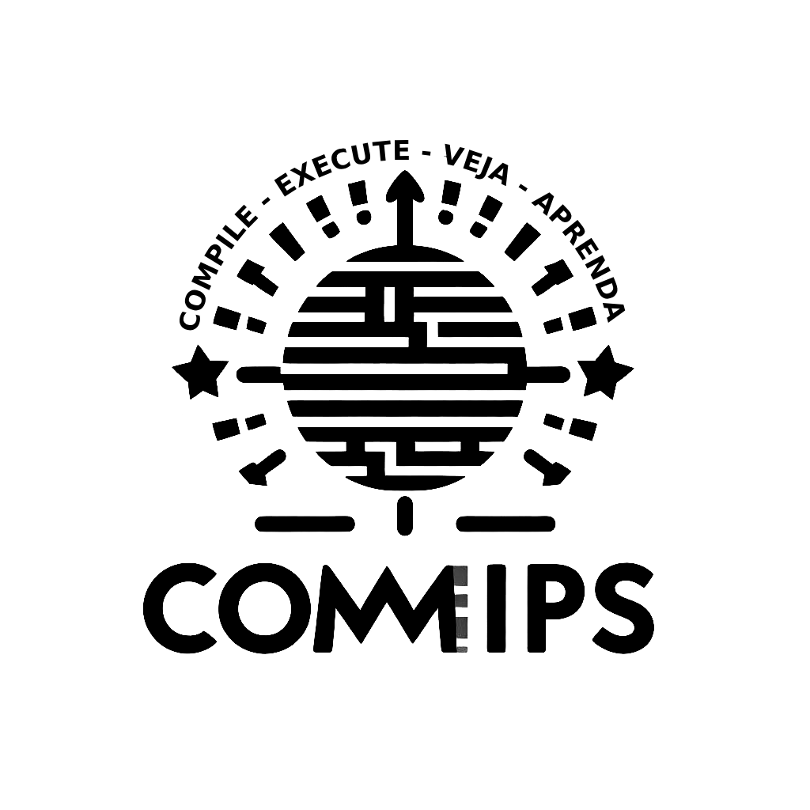

    

## Descrição

O Compilador para MIPS (Commips) é um compilador de linguagem de alto nível em português para código de instrução. O código pode ser gerado em linguagem natural ou em números hexadecimais. Dessa forma, o Commips pode gerar códigos que podem ser executados em simuladores e emuladores de hardware. Além disso, pode contribuir para que o usuário se familiarize com a sintaxe e logica algorítmica por trás dos códigos de instrução.

## Sobre a linguagem P-Mips

P-Mips é uma linguagem voltada para ajudar estudantes de arquitetura de computadores a compreender o funcionamento de um processador. Sua utilização é aconselhada para aqueles que tiveram pouco contato com linguagens de instrução, facilitando a visualização do algoritmo. Mas, também serve para aqueles que gostariam de executar códigos de instrução mas sem abrir mão da legibilidade.

**Lista de comandos aceitos:**

| NOME  | PARÂMETROS        | DESCRIÇÃO                  | OPERAÇÃO               |
| ----- | ----------------- | -------------------------- | ---------------------- |
| NOR   | rd,rs,rt          | Nor                        | rd=~(rs\|rt)           |
| NORI  | rd,rs,imm         | Nor imediato               | rd=~(rs\|imm)          |
| AND   | rd,rs,rt          | E                          | rd=rs&rt               |
| ANDI  | rd,rs,imm         | E imediato                 | rd=rs&imm              |
| OR    | rd,rs,rt          | Ou                         | rd=rs rt               |
| ORI   | rt,rs,imm         | Ou imediato                | rt=rs imm              |
| XOR   | rd,rs,rt          | Ou exclusivo               | rd=rs^rt               |
| XORI  | rt,rs,imm         | Ou exclusivo imediato      | rt=rs^imm              |
| ADD   | rd,rs,rt          | Adicionar                  | rd=rs+rt               |
| ADDI  | rd,rs,imm         | Adicionar imediato         | rd=rs+imm              |
| SUB   | rd,rs,rt          | Subtrair                   | rd=rs-rt               |
| SUBI  | rd,rs,rt          | Subtrair imediato          | rd=rs-imm              |
| MULT  | rs,rt,rd          | Multiplicar                | rd=rs*rt               |
| MULTI | rs,imm,rd         | Multiplicar imediato       | rd=rs*imm              |
| J     | offset(rs)        | Salto                      | pc=pc_upper(rs<<2)     |
| JI    | offset(imm)       | Salto imediato             | pc=pc_upper(imm<<2)    |
| JZ    | offset(rs),rt     | Salto condicional          | if(rt==0) pc+=offset*4 |
| JZI   | offset(imm),rt    | Salto condicional imediato | if(rt==0) pc+=offset*4 |
| LW    | rt,offset(rs),rd  | Carregar palavra           | rt=mem(offset+rd)      |
| LWI   | rt,offset(rs),imm | Carregar palavra imediato  | rt=mem(offset+imm)     |
| SW    | rt,offset(rs),rd  | Salvar palavra             | mem(offset+rd)=rt      |
| SWI   | rt,offset(rs),imm | Salvar palavra imediato    | mem(offset+imm)=rt     |

Para mais informações de sintaxe, [clique aqui](assets/docs/P-Mips.md)

## Como compilar 

Para compilar seus códigos em PMips usando o Commips, basta executar alguns comandos no terminal passando argumentos de acordo com sua preferência de input e output. No comando abaixo, executamos um código exemplo do Commips:

`python3 commips -H -i exemplos/exemplo.pmips -o output.txt`

Para mais informações execute `python3 commips --help`

## Diretrizes de Uso
A equipe por trás deste projeto apoia o uso e desenvolvimento de ferramentas de software livre. Este projeto foi construído com o apoio de ferramentas de código aberto (e.g. Ubuntu e Chromium), sem eles, nada seria possivel, então é justo permitir que desenvolvedores e estudantes a utilizem livremente. O projeto segue uma diretriz de uso livre de atribuição ([CC0 1.0](https://creativecommons.org/publicdomain/zero/1.0/)), o que significa que não há direitos autorais associados. Você pode utilizar e modificar nosso projeto como desejar, sem a necessidade de atribuição (embora ficaríamos muito felizes se você o fizesse, mas apenas se desejar).

> [!NOTE]
> Esse projeto utilizou de ferramentas de inteligência artificial para geração de imagens, correções ortográficas e aperfeiçoamento de legibilidade do código.